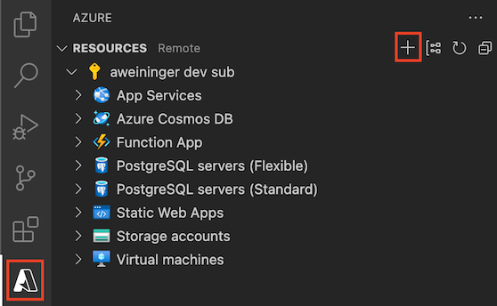
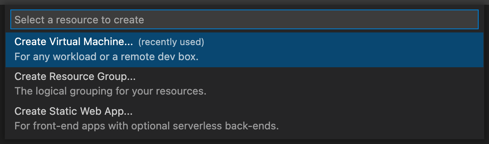
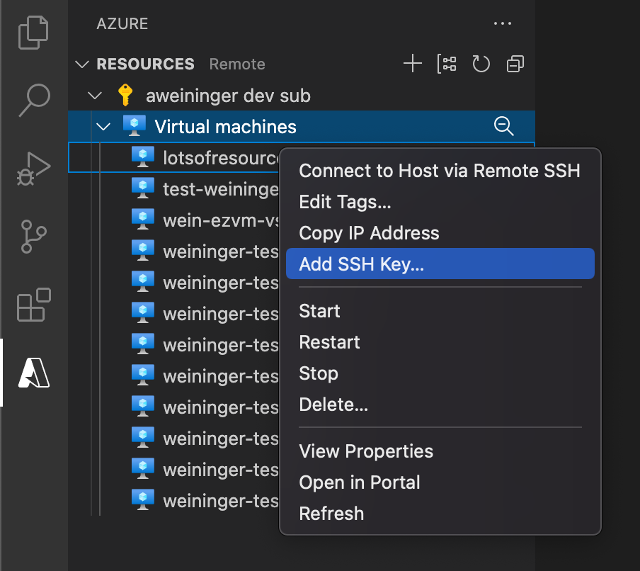
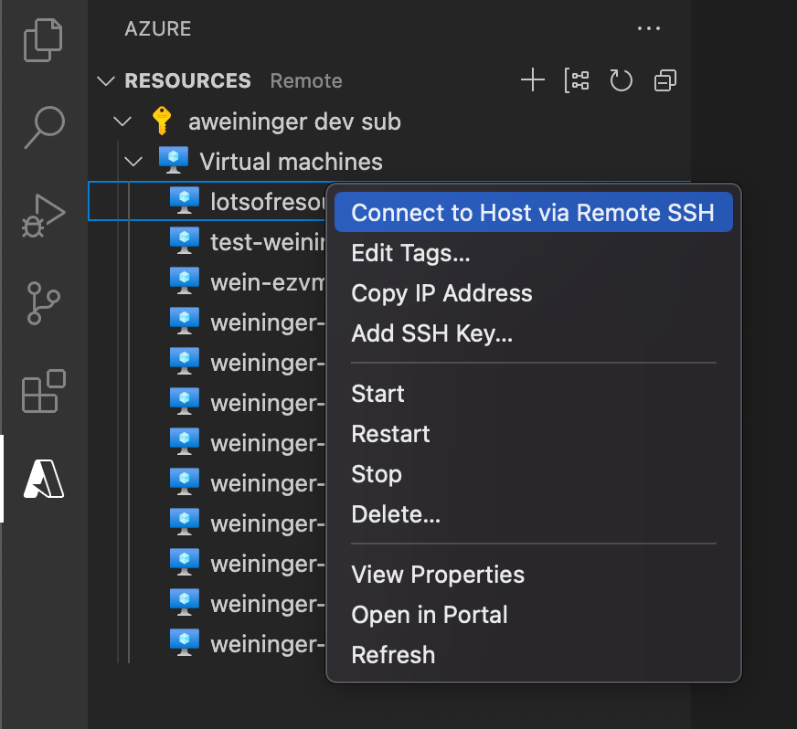

# Azure Virtual Machines for Visual Studio Code (Preview)

<!-- region exclude-from-marketplace -->

   

<!-- endregion exclude-from-marketplace -->

Create and manage Azure Virtual Machines directly from VS Code.

> Sign up today for your free Azure account and receive 12 months of free popular services, $200 free credit and 25+ always free services 👉 [Start Free](https://azure.microsoft.com/free/open-source).

## Installation

1. Download and install the [Azure Virtual Machines extension](https://marketplace.visualstudio.com/items?itemName=ms-azuretools.vscode-azurevirtualmachines) for Visual Studio Code
2. Once complete, you'll see an Azure icon in the Activity Bar
    > If your activity bar is hidden, you won't be able to access the extension. Show the Activity Bar by clicking View > Appearance > Show Activity Bar
3. Sign in to your Azure Account by clicking Sign in to Azure
    >  If you don't already have an Azure Account, click "Create a Free Azure Account" or you can [try Azure for free](https://code.visualstudio.com/tryappservice/?utm_source=appservice-extension)

## Features

* View, create, delete, start, and stop Azure Virtual Machines
* Add SSH key to existing Azure Virtual Machines

### Create a New Virtual Machine

1. Once you are signed in, you can create your Azure Virutal machine by clicking the "+" button or by right-clicking your subscription.

2. Select "Create Virtual Machine..."

3. Type a name for your VM.  Alphanumeric characters are all valid.
4. Type a passphrase or leave it empty for no passphrase.
    >For security reasons, it's _highly_ recommended that you use a passphrase for your SSH key.  It is what will be used to connect to your VM via SSH.

The VM will be **Standard D2s V3** (2 CPU Cores & 8 GB of ram) with the image **Ubuntu 18.04-LTS**. An SSH key will be created and your SSH Config file (`~/.ssh/config`) will be updated so you can immediately connect via SSH (`$ ssh vm-name`) or using the [Remote-SSH](https://marketplace.visualstudio.com/items?itemName=ms-vscode-remote.remote-ssh) extension.

### Add SSH key to existing Virtual Machine

If you have an existing VM that you would like to add your own SSH key too, you can do that by right-clicking the VM tree item, clicking **Add SSH Key...**, and selecting an existing SSH key. You can generate an SSH key using [SSH Keygen](https://www.ssh.com/ssh/keygen#creating-an-ssh-key-pair-for-user-authentication) if you don't have any keys on your system.

Your SSH Config (`~/.ssh/config`) file will be updated so you can connect via SSH using `$ ssh vm-name`.

> NOTE: This command is only available for Linux virtual machines.

### Remote into Azure VM via SSH

- Use [Visual Studio Code Remote - SSH](https://marketplace.visualstudio.com/items?itemName=ms-vscode-remote.remote-ssh) to seamlessly connect to your Azure VM from VS Code.

> NOTE: This command is only available for Linux virtual machines.

<!-- region exclude-from-marketplace -->

## Contributing

There are a couple of ways you can contribute to this repo:

* **Ideas, feature requests and bugs**: We are open to all ideas and we want to get rid of bugs! Use the Issues section to either report a new issue, provide your ideas or contribute to existing threads.
* **Documentation**: Found a typo or strangely worded sentences? Submit a PR!
* **Code**: Contribute bug fixes, features or design changes:
  * Clone the repository locally and open in VS Code.
  * Run "Extensions: Show Recommended Extensions" from the [command palette](https://code.visualstudio.com/docs/getstarted/userinterface#_command-palette) and install all extensions listed under "Workspace Recommendations"
  * Open the terminal (press `CTRL+`\`) and run `npm install`.
  * To build, press `F1` and type in `Tasks: Run Build Task`.
  * Debug: press `F5` to start debugging the extension.

### Legal

Before we can accept your pull request you will need to sign a **Contribution License Agreement**. All you need to do is to submit a pull request, then the PR will get appropriately labelled (e.g. `cla-required`, `cla-norequired`, `cla-signed`, `cla-already-signed`). If you already signed the agreement we will continue with reviewing the PR, otherwise system will tell you how you can sign the CLA. Once you sign the CLA all future PR's will be labeled as `cla-signed`.

### Code of Conduct

This project has adopted the [Microsoft Open Source Code of Conduct](https://opensource.microsoft.com/codeofconduct/). For more information see the [Code of Conduct FAQ](https://opensource.microsoft.com/codeofconduct/faq/) or contact [opencode@microsoft.com](mailto:opencode@microsoft.com) with any additional questions or comments.

<!-- endregion exclude-from-marketplace -->

## Telemetry

VS Code collects usage data and sends it to Microsoft to help improve our products and services. Read our [privacy statement](https://go.microsoft.com/fwlink/?LinkID=528096&clcid=0x409) to learn more. If you don’t wish to send usage data to Microsoft, you can set the `telemetry.enableTelemetry` setting to `false`. Learn more in our [FAQ](https://code.visualstudio.com/docs/supporting/faq#_how-to-disable-telemetry-reporting).

## License

[MIT](LICENSE.md)
